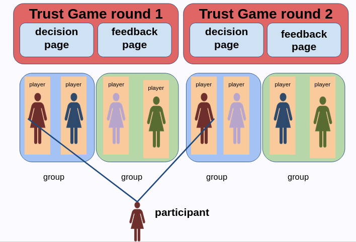
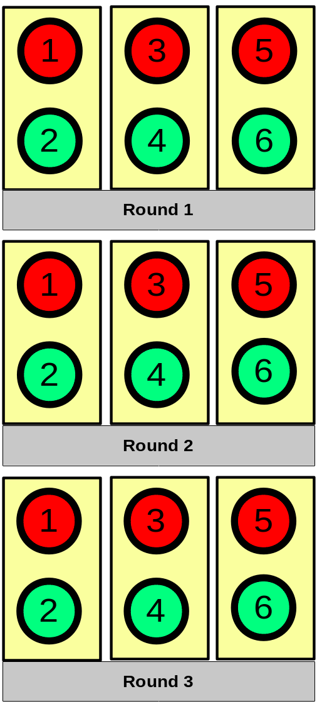
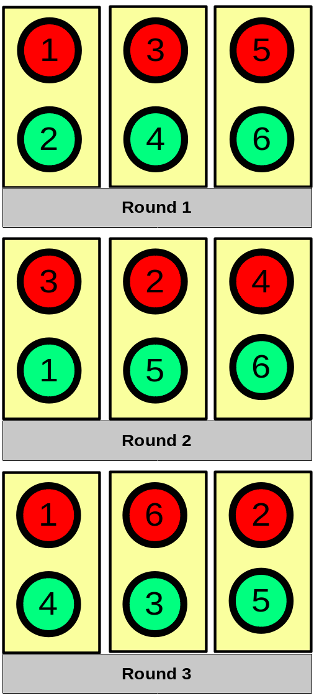
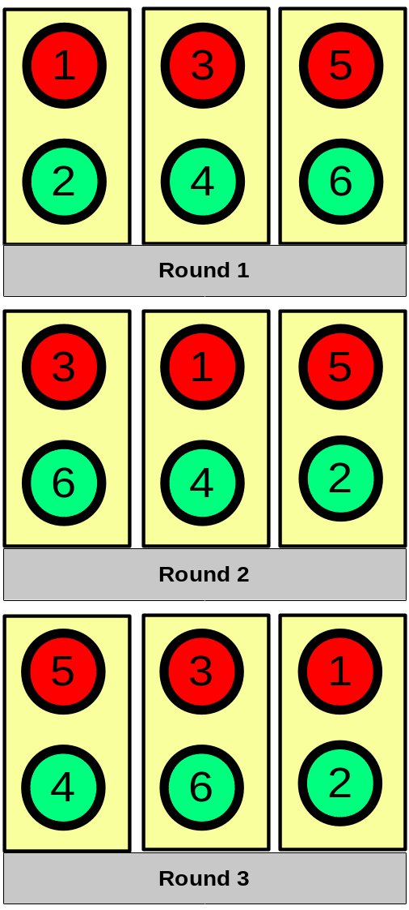
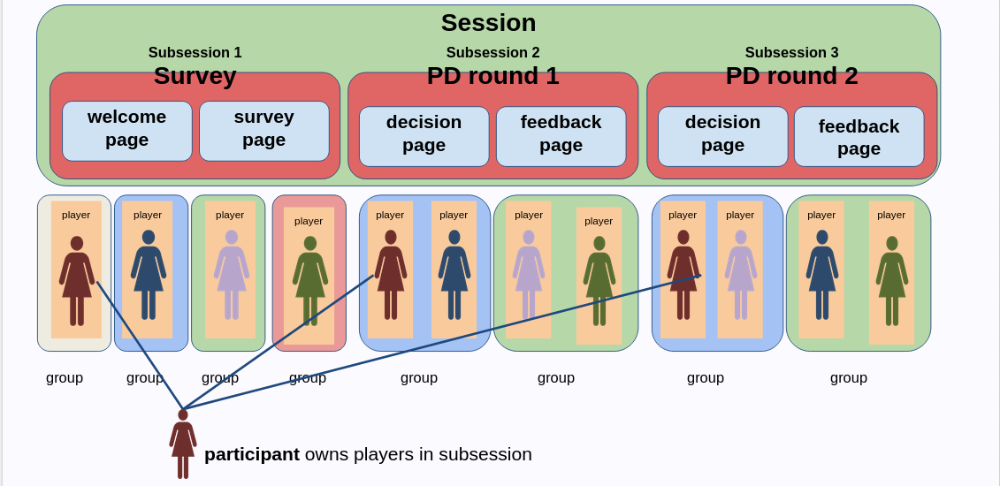
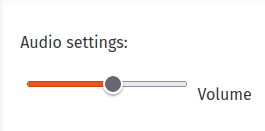
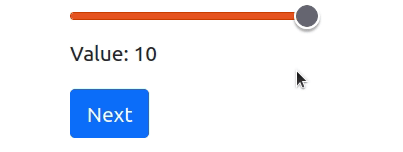
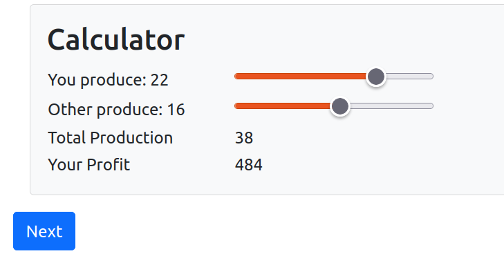

```{css, echo=FALSE}
.remark-code, .remark-inline-code {
  font-size: 80%;
  color: blue;
	background-color: rgba(222,222,222,0.3);
}
.titletext {
	font-size: 400%;
  display:inline-block; 
}

.smaller {
	font-size: 70%;
  display:inline-block; 
}
```

```{r setup, include=FALSE}
knitr::opts_chunk$set(echo = TRUE)

knitr::knit_engines$set(htmlrun = function(options) {
  print(options$code)
  # the source code is in options$code; just do
  # whatever you want with it
})
```
## Multiple Rounds
* Built-in variable for multiple rounds.

```{python, eval=FALSE}
class Constants(BaseConstants):
    name_in_url = 'trust'
    players_per_group = 2
    num_rounds = 1    # <----
    
```
--
* Each `player`, `group` and `subsession` will have the attribute `round_number`.
    * Example: `player.round_number`

---
## Variables when there are multiple rounds
```{r, echo=FALSE, out.width='70%', fig.align='center'}

```
* For each round, there will be a separate `player` object for each participant and a `group` object for each group.

--
* For each participant, `participant` object connects players.
--
* `player.variable_name` written in the previous rounds will not be accessible

---
## Accessing variables when there are multiple rounds

* `player.in_round(n)` brings the player object of a participant at a given round

--
```{python, eval=FALSE}
# Get the player obj in the prev. round
previous_player = player.in_round(player.round_number - 1) 

previous_decision = previous_player.decision

```

---
## For our trust game
```{python, eval=FALSE}
    def vars_for_template(player):
           if player.round_number > 1:
            previous_player = player.in_round(player.round_number - 1)
            previous_sent_amount = previous_player.group.sent_amount
            previous_returned_amount = previous_player.group.returned_amount
            return dict(prev_sent = previous_sent_amount,
                        prev_return = previous_returned_amount)
```
---
## Other methods to gather objects from the previous round

* `player.in_previous_rounds()`: Returns a list of all player objects of the same participant from the previous rounds

* `player.in_all_rounds()`: Returns a list of all player objects of the same participant from the previous round + the current round

* `player.in_rounds(m, n)` Returns a list of players of the same participants from rounds m to n.

[link to documentation](https://otree.readthedocs.io/en/latest/rounds.html?highlight=round#passing-data-between-rounds-or-apps)

---


---
## Matching and Subsession Class
* In oTree, groups are created when the session is created
--
* This is handled by `subsession` class.

--

* A built-in `subsession` function, `creating_session` can be created to monitor/modify this process.

--
* `subsession.get_group_matrix()` shows the matching as a list of list.
    * Each group is a list
    * Order represents id_in_group
    
-- 
```{python, eval=FALSE}
# Add this code to anywhere in your __init__.py file. 
# (ideally under #FUNCTIONS section you've created)

def creating_session(subsession):
    print(subsession.get_group_matrix())

# OUTPUT
# [[1, 2], [3, 4], [5, 6]]
# [[1, 2], [3, 4], [5, 6]]
# [[1, 2], [3, 4], [5, 6]]

```


---
## Matching in multiple round games
.pull-left[
* The default behavior: Roles (`id_in_group`) are fixed, groups are fixed.
]

.pull-right[
```{r, echo=FALSE, out.width='60%', fig.align='center', fig.cap='Default Matching in oTree'}

```
]
---
## Random Group, Random Role
.pull-left[
* To shuffle groups and `id_in_group` in each round, you can use: 

```{python, eval=FALSE}
def creating_session(subsession):
    subsession.group_randomly()
    
```
]

.pull-right[
```{r, echo=FALSE, out.width='60%', fig.align='center', fig.cap='Random Group Random Role'}

```
]
---
## Random Group, Random Role

* You can also condition the shuffling for specific rounds
```{python, eval=FALSE}
# Shuffle only in round 1 and 3, keep the grouping otherwise
def creating_session(subsession):
    if subsession.round_number in [1,3]:
        subsession.group_randomly()
    else:
        subsession.group_like_round(subsession.round_number -1)
    
## GROUPS    
# [[5, 2], [3, 6], [4, 1]]
# [[5, 2], [3, 6], [4, 1]]
# [[2, 4], [6, 5], [1, 3]]
# [[2, 4], [6, 5], [1, 3]]

```
---
## Random Group, Same Role
.pull-left[
* If `group_randomly` takes the argument, `fixed_id_in_group=True`, then it would shuffle in a way that `id_in_group` will be same for each player.

```{python, eval=FALSE}
def creating_session(subsession):
    subsession.group_randomly(fixed_id_in_group=True)
    
# OUTPUT
# [[3, 4], [5, 2], [1, 6]]
# [[3, 4], [1, 6], [5, 2]]
# [[1, 4], [3, 6], [5, 2]]
# [[5, 2], [3, 4], [1, 6]]

```
]

.pull-right[
```{r, echo=FALSE, out.width='60%', fig.align='center', fig.cap='Random Group Same Role'}

```
]
---
## Using a custom matching structure
```
def creating_session(subsession):

    matching = [[1,3], [2,4]]
    subsession.set_group_matrix(matching)
```
---
## Grouping by arrival time
* In online experiments, you often need `group_by_arrival_time`

--

  ```{python, eval=FALSE}
  class GroupingWait(WaitPage):
    group_by_arrival_time = True
    
  page_sequence = [GroupingWait, ...]
  ```

* It works only if the page is a `WaitPage` and it is the first page of the app.
---
## Multiple Apps

* One can add multiple apps. They will be shown in order.

```{python, eval=FALSE}
SESSION_CONFIGS = [
    dict(
        name='trust',
        app_sequence=['consent', 'trust', 'timeout'],
        num_demo_participants=2,
        real_world_currency_per_point= 0.25,
        participation_fee = 3,
    ),
]
```
--

* In oTree You can stop at whatever page/app you'd like.
---

## oTree Structure with Multiple Apps
```{r, echo=FALSE, out.width='70%', fig.align='center'}

```
## Carrying Data Between Apps
* `participant.vars` is a dictionary available during the experiment.
--
* One can add to this field and the value will be kept for all apps, for all players.

```{python, eval=FALSE}
participant.vars['my_field'] = 1
```
---
## Timeouts 

* You can set timeouts for pages. 
* By default, it would try to submit if there is a form, and proceed the participant in the next page.

--
```{python , eval=FALSE}
class MyPage(Page):
    timeout_seconds = 60
```
---
## Detecting Timeouts
* `before_next_page` is another special function defined in pages.
--
* It triggers for each player some desired functions.
--
* It will be supplied with two arguments, `player` object and `timeout_happend`
--

```{python, eval=FALSE}
class Consent(Page):
    timeout_seconds = 30

    def before_next_page(player, timeout_happened):
        if timeout_happened:
            player.timed_out = True

    def app_after_this_page(player, upcoming_apps):
        if player.timed_out:
            return "timeout"

    def before_next_page(player, timeout_happened):
        if timeout_happened:
            player.timed_out = True
```
---
## Using Javascript
* Runs on the browser 

--

* Integrates with HTML items.

--

* While oTree handles backend (and basic frontend), JavaScript and HTML can be used in combination to create custom front-end

---
# Form items with JavaScript
* Let's find a slider:

Mozilla Developers Network - Web Docs  
https://developer.mozilla.org/en-US/docs/Web/HTML/Element/input/range


--
```{r, echo=FALSE, out.width='30%', fig.align='center'}

```
--
```{html, eval=FALSE}
<div>
  <input type="range" id="volume" name="volume"
         min="0" max="11">
  <label for="volume">Volume</label>
</div>
```

---
# Boosting up the form items with JavaScript

```{r, echo=FALSE, out.width='20%', fig.align='center'}

```
* HTML
```{html, eval=FALSE}
<div class="slidecontainer">
  <input type="range" min="1" max="10" value="5" 
         class="slider" id="myRange">
  <p>Value:  <span id="demo"></span></p>
</div>
```

--

* JavaScript
```{js, eval=FALSE, echo=TRUE}
<script>
var slider = document.getElementById("myRange");
var output = document.getElementById("demo");
output.innerHTML = slider.value;

slider.oninput = function() {
  output.innerHTML = this.value;
}
</script>
```
---

## HTML CheatSheet
* Tables
   * `<table> </table>` defines a table
   * `<tr></tr>` defines each row
   * `<td></td>` defines each column.
   
   
* DIV
  * `<div></div>` defines a section in html

* Span 
  * `<span></span>` it is an inline container. 
  
* ID's and Classes
  * Id's are unique
     * `<span id="TitleSpan"></span>`
  * Classes are not unique
     * `<span class="menuItem"></span>`

---

## JavaScript CheatSheet
* All javascript goes to `<script></script>` in HTML

--

* Expressions should be ended with `;`

--


* You can define functions variables with `var` or `let`

--

* You can create a function with:

```{js, eval=FALSE, echo=TRUE}
function functionName(arg1,arg2,...) {
// some things here
return returnValueHere;

}

```
* You can print things in the console with `console.log('thingstoprint')`;

* You can retrieve HTML elements with `document.getElementByID('idhere');`.


---
---
## Cournot Calculator
* We will add `cournot` app from oTree sample games and add a calculator to that. [link](https://github.com/oTree-org/oTree)

```{r, echo=FALSE, out.width='70%', fig.align='center'}

```

---
## HTML
```{html}
        <table style="width:50%">
            <tr>
                <td>
                    You produce: <span id="youValue"> 0</span>
                </td>
                <td>
                    <input type="range" min="0" max="30" value="0" class="slider" id="youProd">
                </td>
            </tr>
            <tr>
                <td>
                    Other produce: <span id="otherValue"> 0 </span>
                </td>
                <td>
                    <input type="range" min="0" max="30" value="0" class="slider" id="otherProd">
                </td>
            </tr>
            <tr>
                <td> Total Production</td>
                <td> <span id="totalProd">0</span></td>
            </tr>
            <tr>
                <td> Your Profit</td>
                <td> <span id="yourProf">0</span></td>
            </tr>
        </table>
    </div>
</div>


```
---
## Javascript
```{html}
<script>
    // Sliders
    var youProd = document.getElementById('youProd');
    var otherProd = document.getElementById('otherProd');
    
    // HTML Spans
    var youValue = document.getElementById('youValue');
    var otherValue = document.getElementById('otherValue');
    var totalProd = document.getElementById('totalProd');
    var yourProf = document.getElementById('yourProf');

    // Function trigger after slider use after slider use
    youProd.oninput = function() {
        youValue.innerHTML = youProd.value;
        calculateProfit();
    }

    otherProd.oninput = function() {
        otherValue.innerHTML = otherProd.value;
        calculateProfit();
    }

    function calculateProfit() {
        totalProd.innerHTML = parseInt(youProd.value) + parseInt(otherProd.value);
        price = 60 - (parseInt(youProd.value) + parseInt(otherProd.value));
        console.log(price);
        yourProf.innerHTML = price * parseInt(youProd.value);
    }
</script>
```
---

## Connecting the template with form

* Using your own custom forms is a bit hacky in oTree
* What to do?:
  1. Create a **field** in your `Player` class
  2. Add it in `form_fields` list in the page
  3. Create a hidden `<input>` in your HTML
  4. Let JavaScript change the value ofthe field

---
# 1. Create the form field
* Go to `__init__.py`

--

* Add (let's call it this2 `selected_number` field in `Player` class.

--
```{python, eval=FALSE}
class Player(BasePlayer):
  #...other integer here
  selected_number = models.IntegerField()

```

---
# 2. Add it in form field of the page
* Go to the `Lottery` page model in `__init__.py`

--

```{python, eval=FALSE}
class Lottery(Page):
    form_model = 'player'
    form_fields = ['selected_number']
```

---
# 3. Create a hidden html input

https://developer.mozilla.org/en-US/docs/Web/HTML/Element/input


--
Example input:
<div>
<input type="text" id="name" name="name" value="This is the value">

</div>
--

```
<input type="text" id="name" name="name" value="This is the value">
```
---
# 3. Create a hidden html input
* We should change the name and the id to the field name
```
<input type="hidden" name="selected_number" id="selected_number" />
```
---
# 4. Create the Javascript code to change the field we added

The original
```
<script>
var slider = document.getElementById("myRange");
var valuetext = document.getElementById("valuetext");
valuetext.innerHTML = slider.value;

slider.oninput = function() {
  valuetext.innerHTML = this.value;
}
</script>
```

---

# 4. Create the Javascript code to change the field we added

Modified JS
```
<script>
var slider = document.getElementById("myRange");
var valuetext = document.getElementById("valuetext");
var hiddenfield = document.getElementById("selected_number") // <- Add This

valuetext.innerHTML = slider.value;

slider.oninput = function() {
  valuetext.innerHTML = this.value;
  hiddenfield.value = this.value; // <- And this
}
</script>
```
---
## Bots - For Testing
* oTree has built-in browser testing capability.
--
* The code for bot tests should be added to `tests.py`
--

* As Dec 2021, bots are still using `self` format.

--
* To start the demo with bots on `settings.py`, session config should get `use_browser_bots = True`

```{python, eval=FALSE}
dict(
        name='trust',
        app_sequence=['trust'],
        num_demo_participants=2,
        real_world_currency_per_point=0.25,
        use_browser_bots = True,
     ),
```

---
## Writing bot tests

Default structure
```{python, eval=FALSE}
from . import *

class PlayerBot(Bot):
    def play_round(self):
       yield PageName     # This will submit the page
```

---

```{python, eval=FALSE}
from . import *

class PlayerBot(Bot):
    def play_round(self):
       yield PageName     # This will submit the page
       yield Return, dict(returned_amount=2)  # This will submit the page with an input

```

---

```{python, eval=FALSE}
class PlayerBot(Bot):
    def play_round(self):
        ## You can add conditional statements
        if self.player.id_in_group == 1:   
            yield Send, dict(sent_amount=5)

        else:
            yield Return, dict(returned_amount=2)

        yield Results
        
        if self.player.round_number == 4:   
            yield FinalResults
```

---

## Bots for the game
* oTree doesn't have a separate in-game bots setup
* Thus bots should be programmatically and number of real players should be considered when designing the game

--
* Public goods game with 1 bot, 2 real players:

 - Players per group: 2
 
```{python, eval=FALSE}
def set_payoffs(group: Group):
    players = group.get_players()
    contributions = [p.contribution for p in players]
    
    # Choice of the robot player
    contribution_robot = random.choice([1,2,3])
    
    # Add to choices
    contributions_w_robot = contributions.append(contribution_robot)
    
    group.total_contribution = sum(contributions)
    
    group.individual_share = (
        group.total_contribution * Constants.multiplier / (Constants.players_per_group + 1) # <----
    )
    for p in players:
        p.payoff = Constants.endowment - p.contribution + group.individual_share


```

---

## Bots when player timed out
```{python, eval=FALSE}
def some_function(player):
   if p.timeout = True:
      p.choice = random.choices([1,2,3])
  

class Send(Page):
    form_model = 'group'
    form_fields = ['sent_amount']

    @staticmethod
    def is_displayed(player: Player):
        return player.id_in_group == 1 and player.timeout == False


```
---
## Resources
* [oTree Documentation](https://otree.readthedocs.io/en/latest/)
* [oTree Mailinglist](https://groups.google.com/g/otree)
* [Matteo Ploner's oTree Course](https://matteoploner.eco.unitn.it/courses/oTreeIntro/oTree.html)
* [oTree Community Book (so far just me)](https://otreecb.netlify.app/intro.html)