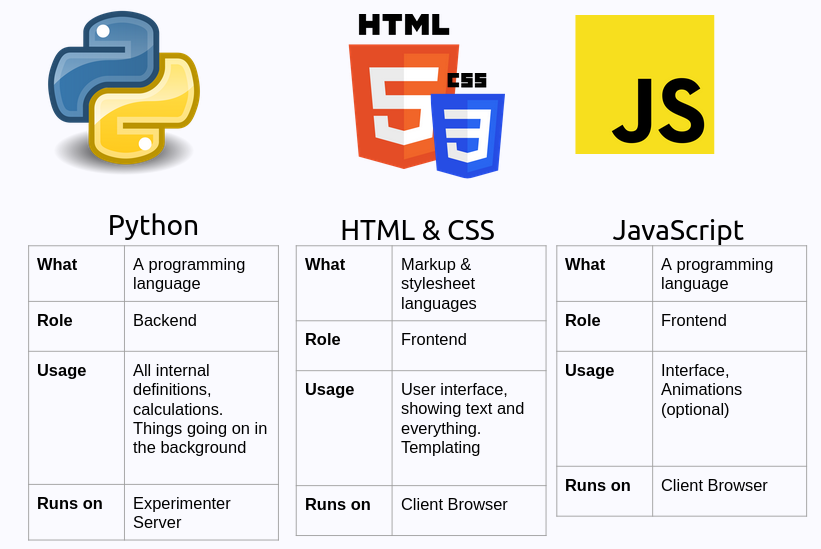
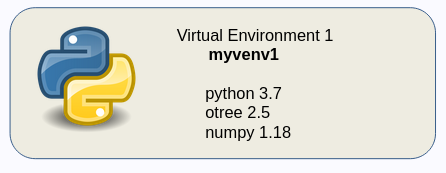
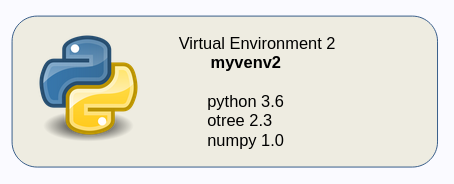
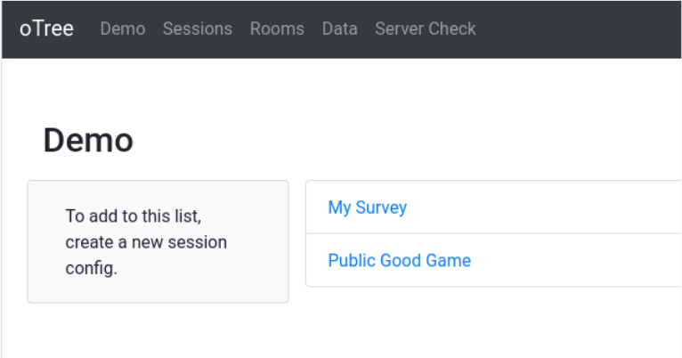
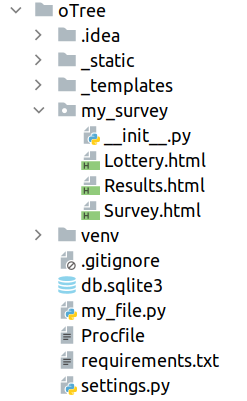
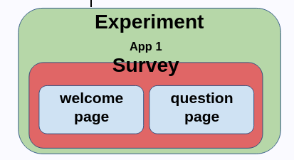
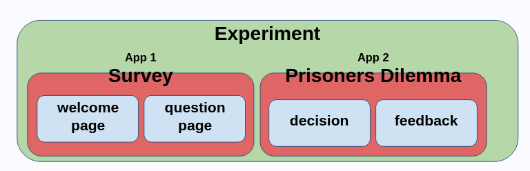
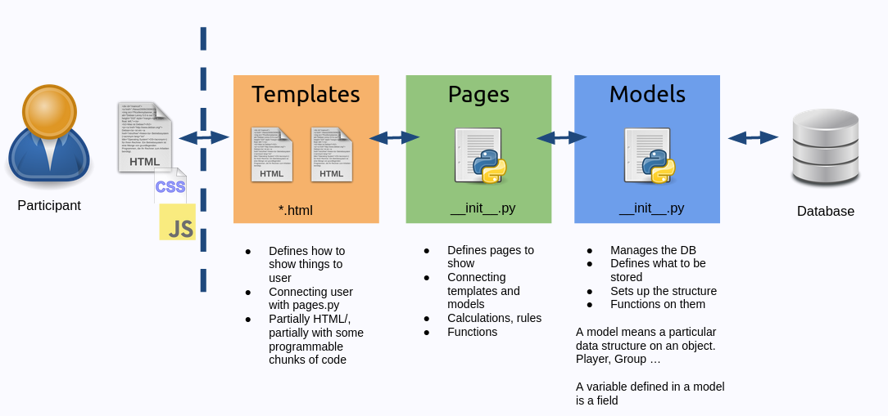

```{css, echo=FALSE}
.remark-code, .remark-inline-code {
  font-size: 80%;
  color: blue;
	background-color: rgba(222,222,222,0.3);
}
.titletext {
	font-size: 400%;
  display:inline-block; 
}
```

```{r setup, include=FALSE}
knitr::opts_chunk$set(echo = TRUE)

knitr::knit_engines$set(htmlrun = function(options) {
  print(options$code)
  # the source code is in options$code; just do
  # whatever you want with it
})
```
# About oTree
* oTree is a platform/software to run lab/online experiments.

--

* Participants interact with each other using their browsers

--
* oTree runs on a web server
--

  * It runs on your computer for development
--
  
  * It may run on a physical server

--
  * It may run on a cloud server

--

* oTree Studio: There is a visual version available (needs paid subscription)  

---
# About oTree
* It essentially works as a "web-page"

--

* oTree handles necessary components like database, pages, urls, ...

--

* Defines a specialized structure for our needs

--
  * Players
  * Groups 
  * Session

---
# Components of an oTree Experiment
```{r, echo=FALSE, out.width='100%', fig.align='center'}

```
---
# What do you need?
* A Python 3 installation

--

* A text editor/IDE to develop Python

--
  * PyCharm
  * Visual Studio Code
  * RStudio
  * Notepad++
  * Even notepad

--

* A command-line interface
---

# Virtual Environments in Python
* A virtual environment is essentially a directory that contains:
  * Python installation
  * A number of additional packages

--

* They provide *isolated* python development enviromens with different packages and dependencies.

--
.pull-left[
```{r, echo=FALSE, out.width='100%', fig.align='center'}

```
]
.pull-right[
```{r, echo=FALSE, out.width='100%', fig.align='center'}

```
]
---
# oTree Development Installation Structure(my suggestion)
```
ot                                        
├── oTree
│   ├── app1
│   ├── app2
│   ├── ...
└── venv   
```
--
* `ot`: A container folder 
* `oTree`: oTree software (project folder)
* `venv`: Virtual Environment
---

# oTree Installation 
1. Create the parent folder `ot`
  ```{bash, eval=FALSE}
  mkdir ot
  ```

2. Go to the folder
  ```{bash, eval=FALSE}
  cd ot
  ```

3. Create the virtual enviroment
  ```{bash, eval=FALSE}
  python3 -m venv venv
  ```

4. Activate the virtual environment
  ```{bash, eval=FALSE}
  # MacOS or Linux
  source venv/bin/activate
  ```
  ```{bash, eval=FALSE}
  # Windows
  venv\Scripts\activate
  ```

---
# oTree Installation
.pull-left[
5\. Install `otree` Package
  ```{bash, eval=FALSE}
  pip install otree
  ```

6\. Create an oTree project
  ```{bash, eval=FALSE}
  otree startproject oTree
  ```
  

7\. Go to oTree folder
  ```{bash, eval=FALSE}
  cd oTree
  ```

8\. Check if oTree is can be startd
  ```{bash, eval=FALSE}
  otree devserver
  ```
]

--

.pull-right[
```
~/ot/oTree> otree devserver    
Open your browser to http://localhost:8000/
To quit the server, press Control+C.
```
]
---
# Command Line Mini Cheatsheet

|Command                  |  Windows               | MacOS/Linux               |
|-------------------------|------------------------|---------------------------|
| print current location  | `pwd`                  |  `cd`                     |
| list files here         | `dir`                  |  `ls`                     |
| go to directory         | `cd NAME`              | `cd NAME`                 |
| create directory        | `mkdir NAME`           | `mkdir NAME`              |
| delete file             | `del filename`         | `rm filename`             |
| activate virtual env.   | `PATH\Scripts\activate`| `source PATH\bin\activate`|
| deactivate virtual env. | `deactivate`           | `deactivate`              | 
| run oTree server (dev.) | `otree devserver`      | `otree devserver`         |
| create app              | `otree startapp APPNAME`| `otree startapp APPNAME` |

---

# oTree Interface

```{r, echo=FALSE, out.width='80%', fig.align='center'}

```

* Demo: A quick way to test experiments
* Sessions: To create and manage sessions
* Rooms: A tool to run experiments on specific links with specific participants
* Data: To download data (all together)
* Server check: Shows a summery of server configuration

---
# oTree File Structure
.pull-left[
```{r, echo=FALSE, out.width='80%', fig.align='left'}

```
]
.pull-right[
* `settings.py`: oTree settings file
* `my_survey` folder: the app in our oTree project. We apps on our own.
  * `__init__.py`: Backend components (pages and models)
  * `*.html`: Frontend components (templates)
] 

---

# What is an app?
* App is the basic unit of an experiment.

* Each experiment should consist at least one app. 

--
```{r, echo=FALSE, out.width='50%', fig.align='center'}

```
---
# What is an app?
* App is the basic unit of an experiment.

* Each experiment should consist at least one app. 

* Experiments may contain more than one app

```{r, echo=FALSE, out.width='70%', fig.align='center'}

```
---
# Create and register an app
* Make sure you have your virtual environment activated

* Make sure you are in the `oTree` (project) folder

* Create the app

  ```{bash, eval=FALSE}
  otree startapp APPNAME
  ```
--

* In our case we will use the name `my_survey`:
  ```{bash, eval=FALSE}
  otree startapp my_survey
  ```
---
# Register the app in the project 
* Go to `settings.py`

* Modify `SESSION_CONFIGS` as below

  ```{python, eval=FALSE}
  SESSION_CONFIGS = [
    dict(
      name='my_survey',
      app_sequence=['my_survey'],
      num_demo_participants=10,
    ),
  ]
  ```
---
# How `__init__.py` looks like?
.pull-left[
```{python, eval=FALSE}
from otree.api import *


doc = """
Your app description
"""

class Constants(BaseConstants):
    name_in_url = 'newapp'
    players_per_group = None
    num_rounds = 1


class Subsession(BaseSubsession):
    pass


class Group(BaseGroup):
    pass


class Player(BasePlayer):
    pass
```
]
.pull-right[
```{python, eval=FALSE}
# PAGES
class MyPage(Page):
    pass


class ResultsWaitPage(WaitPage):
    pass


class Results(Page):
    pass


page_sequence = [MyPage, 
                 ResultsWaitPage, 
                Results]
```
]
---
 
---
# oTree Structure
```{r, echo=FALSE, out.width='100%', fig.align='center'}

```

