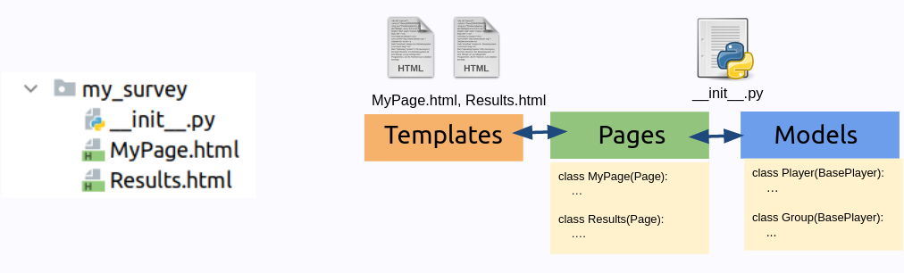

```{css, echo=FALSE}
.remark-code, .remark-inline-code {
  font-size: 80%;
  color: blue;
	background-color: rgba(222,222,222,0.3);
}
.titletext {
	font-size: 400%;
  display:inline-block; 
}

.smaller {
	font-size: 70%;
  display:inline-block; 
}
```

```{r setup, include=FALSE}
knitr::opts_chunk$set(echo = TRUE)

knitr::knit_engines$set(htmlrun = function(options) {
  print(options$code)
  # the source code is in options$code; just do
  # whatever you want with it
})
```
## Individual Experiments

* We have covered individual experiments so far.

--

* Create `Player` fields for the variables written in the data

--

* Create `Pages` for each page we will see and add fields with `form_fields`

--

* Create/modify the templates for each page. (`PageName.html`, `AnotherPage.html`)

--

```{r, echo=FALSE, out.width='100%', fig.align='center'}

```


---

## Group Experiments I - Homogenous Groups
* **Homogenous Groups** 

  * All members have the same role.
  
  * They see the same pages.

--


<br><br><br>

* Some technical aspects differ from the individual experiments:

| Aspect                     | Individual Task        | Group Task                                     |
| -----------------          | ------------------     | --------                                       |
| **Pages**                  | My own pace | Sometimes have to wait for others|
| **Variables / Calculations** | My own variables   | Need to reach other players' variables        |
---
## Waiting for other players
* oTree has a specific type of page called "WaitPage"

--

* Waits for all players in the group. When everybody is thereo, it moves on to the next page. 

--

* You need to add it to `PageSequence` list at the bottom but you don't need to create a template.

--

* It can also trigger some functions when all players in the group reach to the point.

--

* Syntax:
```{python, eval=FALSE}
class ResultsWaitPage(WaitPage):
    pass
```
---

## oTree models
**`__init__.py`**:
```{python, eval=FALSE}
# MODELS
class Constants(BaseConstants):
    name_in_url = 'my_survey'
    players_per_group = None
    num_rounds = 1


class Subsession(BaseSubsession):
    pass


class Group(BaseGroup):
    pass


class Player(BasePlayer):
    some_individual_variable = models.IntegerField()
```

---
# Models
* They are managing objects which represent players/groups/the constants and handle database entries.
--

* Four built-in models:
  * `Player`: Parameters that are unique for each individual.
  
  * `Group` : Parameters that are unique for the group, same for each individual in the group.
  
  * `Constants`: Parameters that are the same for the experiment.
     * Beware:Constants are not written on the data!
  
  * `Subsession`: Parameters that are same for the "subsession". More often used to initiate some specific settings. We will see it next week.
---

## Setting group size

* Groups structure is created and handled automatically by oTree

```{python, eval=FALSE}
class Constants(BaseConstants):
    # ...
    players_per_group = 3
    # ...
    
```
---
## `Player` and `Group` classes
* Classes are like blueprints, declaring the design
* They are capitalized. (`Player`, `Group`)
```{r, echo=FALSE, out.width='90%', fig.align='center'}

```


---
## `Player` and `Group` instances  
* Instances are objects created from classes

--

* They are lowercase. (`player`, `group`)

--

* We usually deal with them in computations
--

* They have attributes(variables) 
    * Built-in defined in the relevant model
    * Each player object holds its own value
--

* They have functions defined in the class(methods) 
    * Built-in or defined somewhere in `__init__.py`

---
## `Player` and `Group` instances
```{r, echo=FALSE, out.width='60%', fig.align='center'}

```

---
### Reaching to players in a group
* Groups contain players
* `some_list = group.get_players()`
* That list contains players

* `some_list[0]`, `some_list[1]`, `some_list[2]`
* We can loop over that:

```{python, eval=FALSE}
players = group.get_players()

for p in players:
  p.do_something()
  p.my_player_variable

```

---
### Reaching to its group from a player
```{python, eval=FALSE}
player.group  # linked to group object

player.group.my_group_variable
player.group.do_something()
```
---
class: inverse

.center[.titletext[Let's build a game and see it in practice]]
---
# See the demo
<h1><a href="https://xpsurvey.com/room/erfurt"> xpsurvey.com/room/erfurt </a></h1>

---
## The Guessing Game
.pull-left[
* Groups of 5 (we can take 3 for convenience)

* Participants pick a number between 0 to 10.

* Those who picked the closest number to **2/3 of the average** wins 10 EUR.
  
* Show-up fee: 5 EUR.
]

.pull-right[
```{r, echo=FALSE, out.width='100%', fig.align='center'}

```


]
---
## Building the Guessing Game
* Let's activate our virtual environment and go to our oTree folder
* Alternatively we can create a new project

--

* Start a new app
```
otree startapp guessing
```
---
## Let's plan first our pages
| Page                |  Description      |
|---------------------|-------------------|
| `Guessing`          | Guessing screen   |
| `Results`           | Results screen    |

---

## We need a WaitPage before the calculations

| Page                |  Description      |
|---------------------|-------------------|
| `Guessing`          | Guessing screen   |
| **`ResultsWaitPage`**   | Waiting page      |
| `Results`           | Results screen    |

---

# Fields

| Variable          |    Model    |     Type      |       |
|-------------------|-------------|------------------|----|
| `guess`           | `Player`    | `IntegerField()` | Player's guess |
--
| `average_guess`   | `Group`     | `FloatField()`   | Average guess in the group|
--
| `multiplier`      | `Constants` | Constant         | Ratio of the average for the target number |
--
| `target_number`   | `Group`     | `FloatField()`   | Target number |
--
| `distance`        | `Player`    | `FloatField()`   | Difference to target value |
--
| `is_winner`       | `Player`    | `BooleanField()` |  Whether participant won or not |
--
| `reward`          | `Constants` | Constant         | Reward amount |
--
| `payoff`          | `Player`    | BUILT IN `Integer` |  |
---


## `Currency` and `payoff` built-in features in oTree

* oTree has built-in currency field : `Currency`
* Handles monetary calculations and currency symbols.

--
* Each player has already a `payoff` field
* Payoff will be converted to real money at the end.


--

* `settings.py` controls conversion and currency.

---

## Calculations in `oTree`

* You can write functions in `__init__.py`

--
* Functions get `player` or `group` as input

```{python, eval=FALSE}
def set_payoffs(group):
    # do something
```
--

* These functions don't run automatically. It should be triggered.

---

## Triggering a function in a `WaitPage` 
* `WaitPage` have a built in variable `after_all_players_arrive`.

--

* It takes the name of the function to be executed.

--

* Executes it when all players arrive in the WaitPage, before moving to the next page

--
```{python, eval=FALSE}
class ResultsWaitPage(WaitPage):
    after_all_players_arrive = 'set_payoffs'

```

---
## Template features

* Templates have access to `player`, `group` and `Constants` variables.

   ```
       Your guess was {{ player.guess }}.
       Your group decided on {{ group.decision }}
       The reward was {{ Constants.reward }}
       You will get {{session.config.participation_fee}} for participating.
   ```
   
--
   
* You can show less digits of decimals with `| to0`, `|to1`, `|to2`.


---

## Template features

* If you want to show a variable that doesn't exist in your models, you can use a page function called `vars_for_template`

--

```{python, eval=FALSE}

class Results(Page):
    
    def vars_for_template(player):

        return dict(
            variable_to_show=432,
        )
```
  
* Then you can reach it in the template by:

```
{{ variable_to_show }}

```
---
# Final Code

* Models (`__init__.py`)

```{python, eval=FALSE}

# MODELS
class Constants(BaseConstants):
    name_in_url = 'guessing'
    players_per_group = 3
    num_rounds = 1
    multiplier = 2/3   # 2/3 of the averages
    reward = Currency(10)


class Subsession(BaseSubsession):
    pass


class Group(BaseGroup):
    average_guess = models.FloatField()
    target_number = models.FloatField()

class Player(BasePlayer):
    guess = models.IntegerFiel(label= "Pick a number", min=0, max=100)
    distance = models.FloatField()
    is_winner = models.BooleanField(initial=False)


```
---
# Final Code

* Functions (`__init__.py`)
```{python, eval=FALSE}
# FUNCTIONS
def set_payoffs(group):
    players = group.get_players()
    guesses = [p.guess for p in players]
    
    group.average_guess = sum(guesses) / Constants.players_per_group
    group.target_number = group.average_guess * Constants.multiplier
    
    for p in players:
        p.distance = abs(p.guess - group.target_number) # This is for my data

    distances = [p.distance for p in players]
    minimum_distance = min(distances)

    for p in players:
        # if the player is the winner
        if p.distance == minimum_distance:
            p.is_winner = True
            p.payoff = Constants.reward


```

---
# Final Code

* Pages (`__init__.py`)

```{python, eval=FALSE}

# PAGES
class Welcome(Page):
    pass

class Guessing(Page):
    form_model = "player"
    form_fields = ['guess']

class ResultsWaitPage(WaitPage):
    after_all_players_arrive = 'set_payoffs'

class Results(Page):
    @staticmethod
    def vars_for_template(player):
        guesses = [p.guess for p in player.group.get_players()]

        return dict(
            guesses=guesses,
        )


page_sequence = [Welcome, Guessing, ResultsWaitPage, Results]

```

# Final Code
* `Guessing.html`

```
{{ block title }}
Guess the 2/3 of the Average
{{ endblock }}
{{ block content }}

{{ formfields }}

{{ next_button }}

{{ endblock }}


```
---

# Final Code
* `Results.html`

```
{{ block title }}
Results
{{ endblock }}

{{ block content }}
<p>
    Your guess was <strong>{{ player.guess }}</strong>.
</p>
<p>
    The all guesses in the group are the following: <strong>{{ guesses }}</strong>.
</p>
<p>
    The average guess was <strong>{{ group.average_guess | to2 }}</strong>. The 2/3 of the average guess was <strong>{{ group.target_number | to2 }}</strong>.
</p>

        {{ if player.is_winner }}
        <h4 style="color:green;">  You won! </h4>
        {{ else }}
        <h4 style="color:red;">  You didn't win! :( </h4>
        {{ endif }}

        <p>
            Your won {{ player.payoff }} from this round.
        </p>
        <h5>Your final earning is {{ participant.payoff_plus_participation_fee }}. </h5>

<br><br>
<p><strong> Thank you very much for participating in our experiment. Now you can close this browser.</strong></p>
{{ endblock }}
```
