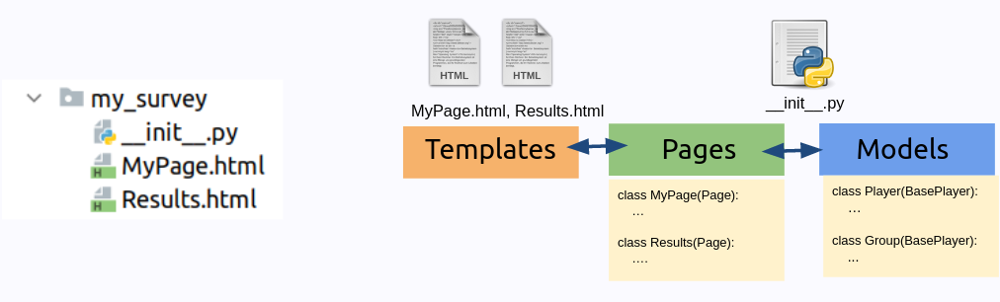
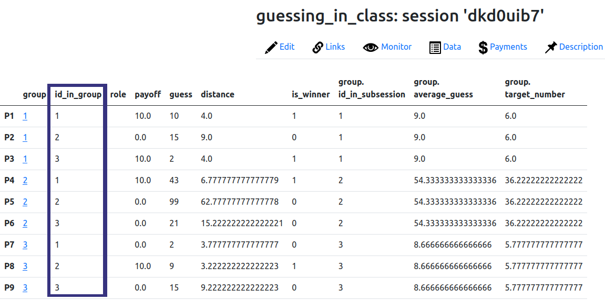
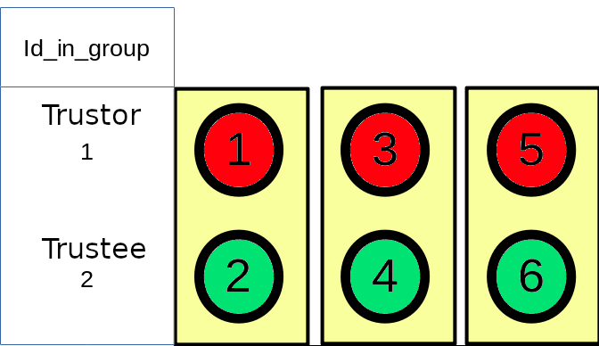
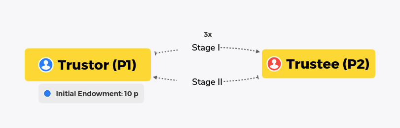
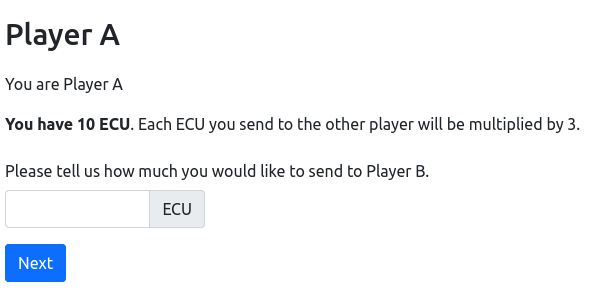
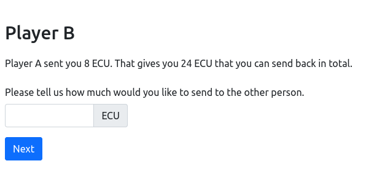

```{css, echo=FALSE}
.remark-code, .remark-inline-code {
  font-size: 80%;
  color: blue;
	background-color: rgba(222,222,222,0.3);
}
.titletext {
	font-size: 200%;
  display:inline-block; 
}

.smaller {
	font-size: 70%;
  display:inline-block; 
}
```

```{r setup, include=FALSE}
knitr::opts_chunk$set(echo = TRUE)

knitr::knit_engines$set(htmlrun = function(options) {
  print(options$code)
  # the source code is in options$code; just do
  # whatever you want with it
})
```
## Recap of previous lecture

* We have covered group experiments where the individuals had the same role.

--

* We created `Player` fields for the individual level data and `Group` fields 

--

* And as usual we created `Page` classes for each page we will see and add fields with `form_fields`. We created a template for each one.

--

* We created a `group` function to set payoffs and triggered it at the waiting page by setting `after_all_players_arrive` variable to the name of our function.

--

* Now we will see how the design changes when we have different roles.

--

```{r, echo=FALSE, out.width='100%', fig.align='center'}

```

---
## Waiting for other players and trigering a function

```{python, eval=FALSE}
class ResultsWaitPage(WaitPage):
    after_all_players_arrive = "my_group_function"
```
---

## Group Experiments II - Heterogenous Groups

<br><br><br>

* Some technical aspects differ from the individual experiments:

| Aspect                     | Homogeneous Groups        | Heterogeneous Groups                                     |
| -----------------          | ------------------     | --------                                             |
| **Pages**                  | Everybody sees every page |  Some pages might be shown to specific groups only|
--

| **Variables / Calculations** | Calculations are the same for everybody   | Role specific calculations might be necessary |
---
## Heterogenous Groups
In this section, we will focus on the case when the players have different roles. Games with heterogeneous agents have some unique aspects we need to handle:

  * We should be able to identify each player in group in order to give them role-specific tasks object

  * We should be able to show each player different screens

---
## Identifying Participants in a Group


* oTree already have a structure to deal with individuals roles in a group.

--

* `player.id_in_group`: Each player gets an integer from 1 to n as their id
  
--

```{r, echo=FALSE, out.width='100%', fig.align='center'}

```

---
## Default behavior `id_in_group` in oTree

```{r, echo=FALSE, out.width='70%', fig.align='center'}
knitr::include_graphics('images/mtc_grouping_with_ids.png')
```

* `id_in_group` stays the same for an app for a round.
--

* `id_in_group` stays the same as for multiple rounds by default.

--
* When participants use the same link (as opposed to the individual links), they will be grouped one by one.

---
## Roles can be defined based on `id_in_group`
```{r, echo=FALSE, out.width='70%', fig.align='center'}

```
---

###  Calling players by id
* In the guessing game, our players were identical. So we could loop over players like

  ```{python, eval=FALSE}
  # Gets all the players and puts them in a list
  players = group.get_players()
  
  for p in players:
    do_something(p)
    p.some_attribute = some_number
    #...
    
  ```
--
* We could also do:

  ```{python, eval=FALSE}
  players = group.get_players()
  
  first_player = players[0]
  second_player = players[1]
  third_player = players[2]
  
  do_something(first.player)
  first_player.some_attribute = some_number 
  
  do_something(second_player)
  # ...
  ```
---
### Calling players by id: `group.get_player_by_id()`

* `get_player_by_id()` is a group method

* Takes a number from 1 to n to get the player object of the group member 

  ```{python, eval=FALSE}
  trustor = group.get_player_by_id(1)
  trustee = group.get_player_by_id(2)
  
  trustor.payoff = endowment - sent_amount + returned amount
  
  ```
---
## Displaying pages conditionally 
* Built in method to be defined under a page (can be outside as well)

* If this method returns `True` for current player, the page is displayed. Otherwise, it will not.

* If there are any calculations triggered by page, they will be skipped as well.

    * For a specific player:
      ```{python, eval=FALSE}
      
      class PageForTrustor(Page):

          def is_displayed(player):
              return player.id_in_group == 1
          
      ```
--
    * In a specific round
      ```{python, eval=FALSE}
      
      class PageForTrustor(Page):

          def is_displayed(player):
              return player.round_number == 1
          
      ```
      


<br>
<br>
[Documentation Link](https://otree.readthedocs.io/en/latest/pages.html?highlight=skip%20app#is-displayed)
---
class: inverse

<br>
<br>
<br>
<br>
Let's put those into practice 
<br>
<br>
<br>
<br>
.center[.titletext[Building a trust game]]
---
# The Trust Game

```{r, echo=FALSE, out.width='80%', fig.align='center'}

```
--
.pull-left[
```{r, echo=FALSE, out.width='100%', fig.align='center'}

```
]
--
.pull-right[
```{r, echo=FALSE, out.width='100%', fig.align='center'}

```
]


---
# See the demo
<h1><a href="https://xpsurvey.com/room/erfurt"> xpsurvey.com/room/erfurt </a></h1>

---
## Planning Pages
| Page         | Description                   | Shown |
| -------------| ----------------------------- |-------|
| Send         | Send amount from P1 to P2     | P1    |
--

| Return       | Return amount from P2 to P1   | P2    |

--
| Results      | Show Results                  | Both  |
---
## Planning Pages
| Page         | Description                   | Shown |
| -------------| ----------------------------- |-------|
| Send         | Send amount from P1 to P2     | P1    |
| WaitForP1    |                               |       |
| Return       | Return amount from P2 to P1   | P2    |
| WaitForP2    |                               |       |
| Results      | Show Results                  | Both  |
---

## Game Parameters
| Parameter             | Description                           | Scope     | Field/Type       |
| -------------         | ----------------------------------    | --------  | ----------       |
| players_per_group     | (built-in) Number of players in group | Constants |                  |
| initial_endowment             | Initial endowment of P1               | Constants |`Currency()`   |
| multiplier      | The multiplier of P1's transfer to P2 | Constants |                  |
| sent_amount            | The amount sent by P1 to P2           | Group     | **CurrencyField** |
| returned_amount        | The amount sent back by P2 to P1      | Group     | **CurrencyField** |

---
## Using Experimental Currencies
* `settings.py` controls the parameters for currency types
```{python, eval=FALSE}
# e.g. EUR, GBP, CNY, JPY
REAL_WORLD_CURRENCY_CODE = 'USD'
USE_POINTS = True
```
--
* Let's modify these
```{python, eval=FALSE}
REAL_WORLD_CURRENCY_CODE = 'EUR'
USE_POINTS = True
POINTS_CUSTOM_NAME = 'ECU'
```
---
# Then let's create our app `trust`
* Create the app
```
otree startapp trust
```
--

* Add the app to `settings.py`

```{python, eval=FALSE}
SESSION_CONFIGS = [
     dict(
         name='trust',
         app_sequence=['trust'],
         num_demo_participants=2,
     ),
]

```
---

## Game Parameters
| Parameter             | Description                           | Scope     | Field/Type       |
| -------------         | ----------------------------------    | --------  | ----------       |
| players_per_group     | (built-in) Number of players in group | Constants |                  |
| initial_endowment             | Initial endowment of P1               | Constants |`Currency()`   |
| multiplier      | The multiplier of P1's transfer to P2 | Constants |                  |
| sent_amount            | The amount sent by P1 to P2           | Group     | **CurrencyField** |
| returned_amount        | The amount sent back by P2 to P1      | Group     | **CurrencyField** |

---
# Pages
| Page         | Description                   | Shown |
| -------------| ----------------------------- |-------|
| Send         | Send amount from P1 to P2     | P1    |
| WaitForP1    |                               |       |
| Return       | Return amount from P2 to P1   | P2    |
| WaitForP2    |                               |       |
| Results      | Show Results                  | Both  |
---

---
# Adding Conditions to Pages

```{python, eval=FALSE}
  class Send(Page):
    form_model = "group"
    form_fields = ['sent_amount']

    @staticmethod
    def is_displayed(player):
        return player.id_in_group == 1


class Return(Page):
    form_model = "group"
    form_fields = ['returned_amount']

    @staticmethod
    def is_displayed(player):
        return player.id_in_group == 2

```
---
### Why add staticmethod?
* `@staticmethod` is a stylistic definition. It tells the function inside a class that it is not a function of class (but `player`,`group` and so on.)

--

* The code would work just fine without `@staticmethod` but the editors will handle the file better (autocomplete etc.)

---
## Displaying the maximum amount that can be sent

* `vars_for_template` is used to access variables/objects that are not a part of `player`, `group` `session` and `participant` in a template.


--

* Defined as a method under a page. (can be also defined standalone)

--

* We can calculate the amount and send it to the relevant page

--

```{python, eval=FALSE}
class Return(Page):
  # other stuff
  def vars_for_template(player: Player):
    returnable_amount = player.group.sent_amount * Constants.multiplier
    return dict(returnable_amount = returnable_amount)

```

<br>
<br>
<br>

[Documentation Link](https://otree.readthedocs.io/en/latest/pages.html?highlight=vars_for_template#vars-for-template)

---


## Setting maximum and minimum dynamically
* Create a function with the name **fieldname**_max.

* This function should return the amount for the maximum 

--

```{python, eval=FALSE}
def returned_amount_max(group):
    return group.sent_amount * Constants.multiplier
```

--
* Also `fieldname_min` and `fieldname_errormessage`
<br>
<br>
<br>
<br>
<br>
<br>
<br>
<br>

[Documentation Link](https://otree.readthedocs.io/en/latest/forms.html?highlight=_max#field-name-max)

---
## Setting Payoffs

* Now we can define our `set_payoff` function.

* This function is standalone (not under a class) and it always takes `group` as an argument.

```{python}
def set_payoffs(group):
    p1 = group.get_player_by_id(1)
    p2 = group.get_player_by_id(2)

    p1.payoff = Constants.initial_endowment - group.sent_amount + group.returned_amount
    p2.payoff = group.sent_amount * Constants.multiplier - group.returned_amount
```
---
## Triggering `set_payoffs`

* Then we need to create the the relevant `WaitPage` to trigger it:

```{python, eval=FALSE}
class WaitForB(WaitPage):
    after_all_players_arrive = set_payoffs
```

---

# Preparing Results Page
* We can have a single page with if conditions

```
    {{ if player.id_in_group == 1 }}
      <ul>
            <li> You had {{ Constants.initial_endowment }} </li>
            <li> You sent Player B {{ group.sent_amount }}.</li>
            <li> Player B returned {{ group.returned_amount }}. </li>
        </ul>
        </p>
    {{ else }}
            <p>
            <ul>
                <li>Player A sent you {{ group.sent_amount }}. </li>
                <li>You returned {{ group.returned_amount }}. </li>

            </ul>
            </p>
    {{ endif }}
```
---

## Payoff Relevant Variables in a Template
* In oTree, there is a separate `player` object for each participant in each app or in each round.
--

* oTree represents a participant with `participant` object within all rounds and apps. 

--

* It tracks payoff relevant information for each round/each app and update `participant` variables

--

* Some important variables:
  * `participant.payoff`: Total payoff in each app in the currency/points
  * `participant.payoff_in_real_world_currency`: Total payoff after the payoff is converted
  * `participant.payoff_plus_participation_fee`: Payoff + participation fee
  
--
* You can access the participation fee by `session.config.participation_fee`

---
## Payoff relevant information in Results
```
    <p>
        Your payoff from this stage is {{ participant.payoff }}. 
        It is converted to {{ participant.payoff_in_real_world_currency }}.
        You earned {{ session.config.participation_fee }} a fixed 
        show-up fee for participating in this experiment.
    </p>

    <h5>In total, your final earning 
    is {{ participant.payoff_plus_participation_fee }}. </h5>

```