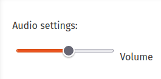
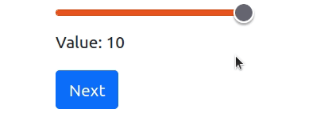

```{css, echo=FALSE}
.remark-code, .remark-inline-code {
  font-size: 80%;
  color: blue;
	background-color: rgba(222,222,222,0.3);
}
.titletext {
	font-size: 400%;
  display:inline-block; 
}

.smaller {
	font-size: 70%;
  display:inline-block; 
}
```

```{r setup, include=FALSE}
knitr::opts_chunk$set(echo = TRUE)

knitr::knit_engines$set(htmlrun = function(options) {
  print(options$code)
  # the source code is in options$code; just do
  # whatever you want with it
})
```
# Individual Decisions in oTree
* Although oTree is designed for multiplayer games, it is also suitable for individual decision making experiments

--

* Usually we need only `Player` and `Constants` class
---
# Usual steps to create an oTree experiment
1\. Create a project (top level oTree installation)

--

  ```{bash, eval=FALSE}
  otree startproject oTree 
  # or any other name instead of 'oTree'
  ```
  
--

2\. Create an app (or multiple apps for the project)

--

  ```{bash, eval=FALSE}
  otree startapp APPNAME
  # whatever app name you prefer
  ```
  
3\. Register the app in `settings.py`

--

  ```{python, eval=FALSE}
  SESSION_CONFIGS = [
      dict(
        name='my_survey',
        app_sequence=['my_survey'],
        num_demo_participants=50,
     ),
  ]
  ```

---
# Usual steps to create an oTree experiment

4\. Implement your data structure (** your models**)
--

  * Go to `__init__.py` and
  * Add your fields in `Player` and `Group` classes
  
  ```{python, eval=FALSE}
  class Player(BasePlayer):
    name = models.StringField(blank=True, label="Your name (optional)")
    ...
  ```  

--

5\. Implement your **pages** in Python

--

  * Go to `__init__.py` and create a class for each page 
  
  ```{python, eval=FALSE}
  class Survey(Page):
      form_model = "player"
      form_fields = ['name', 'age', 'mood', 'wants_feedback']
  ```  

--

6\.  Create HTML **templates** for your pages
--

  * Each html must have the same name with the Page class you created.
    * For instance `Survey.html`
  * oTree automatically handles most of it.

---
# Let's create a survey for our employees
.pull-left[
```{r, echo=FALSE, out.width='100%', fig.align='center'}
knitr::include_graphics('images/survey_preview.png')
```  
]

--

.pull-right[
* We would like to have the following columns:
  * `name`: Participant Name (optional)
  
  * `age` : Age
  
  * `mood`: How do they feel today? Categorical: `bad`, `okay`, `wonderful`
  
  * `wants_feedback`: Yes or No
  
  * `comments`: Text
]  
---
# Creating Fields in our models

| Variable          |  Field Type      |
|-------------------|------------------|
| `name`            | `StringField`    |
| `age`             | `IntegerField`   | 
| `mood`            | `StringField`    |
| `wants_feedback`  | `BooleanField`   |
| `comments`        | `LongStringField`|

* Each field will be defined under `Player` class

---
# Fields 
* Fields create the data structure to record the data. They can be thought as “columns” in a spreadsheet. 
* They are placed in Player or Group classes in `__init__.py`
* You can create a field for form input, or to save the data without an explicit input

| Field Name      | What for?                  | Example                                  |
|-----------------|----------------------------|------------------------------------------|
| StringField     | Short text, Categories     | `department = Models.StingField()`       |
| IntegerField    | Integer (whole numbers)    | `age = Models.IntegerField()`            |
| FloatField      | Decimals                   | `percentage = Models.FloatField()`       |
| BooleanField    | True or False              | `is_dictator = Models.BooleanField()`    |
| CurrencyField   | Numbers in currency format | `earned_stage1 = Models.CurrencyField()` |
| LongStringField | Long test                  | `diary_entry = Models.LongStringField()` |
---
# Some field options
.smaller[
* Adding labels
  ```{python,eval=FALSE} 
   models.StringField(label = “What is your name”)
   ```

* Minimum, maximum
  ```{python,eval=FALSE}
  models.IntegerField(min = 18, max = 117)
  ```
* Empty allowed
  ```{python,eval=FALSE}
models.Integerfield(blank = True)
  ```
* Default Value
  ```{python,eval=FALSE}
  models.IntegerField(initial = 20)
  ```

* Multiple choices
  ```{python,eval=FALSE}
  department = models.StringField(choices = [“Economics”, “Law”])
  ```
* Radio buttons 
  ```{python,eval=FALSE}
  department = models.StringField(choices = [“Economics”, “Law”], widget=widget.RadioSelect)
  ```
]


---

# Creating Pages

| Page                |  Description      |
|---------------------|-------------------|
| `Survey`            |  Survey questions |
| `Results`           |  Feedback         |

* Each page will have a 

--

  * Class in `__init__.py` 
  
--

  * They should be added to `page_sequence` list
  
--

  * Will have a `html` template in the same folder

---
# Creating Templates
* We will take advantage of the default template

```
{{ block title }}
    TITLE HERE
{{ endblock }}

{{ block content }}
CONTENT HERE
    {{ formfields }}   <--- This generates input fields automatically

{{ next_button }}      <--- This creates a next button
{{ endblock }}
```

---
# Template Syntax

* Templates use HTML codes, and oTree template items (indicated by `{{ }}`).

* Indentation is not important in templates.

* oTree has two default blocks:` {{ block title }}`, and `{{ block content }}`

* You can reach variables of the player with `{{ player.variablename }}`

* You can have conditional content by `{{ if CONDITION }}`

.pull-left[
  ```
    {{ if CONDITION}}
    ...
    {{ endif }}
  ```
]
-- 

.pull-right[
  ```
    {{ if CONDITION}}
    ...
    {{ else }}
    ...
    {{ endif }}
  ```
]
---


---
class: inverse

.center[.titletext[Bonus: If time permits]]
---


# Form items with JavaScript
* Let's find a slider:

Mozilla Developers Network - Web Docs  
https://developer.mozilla.org/en-US/docs/Web/HTML/Element/input/range


--
```{r, echo=FALSE, out.width='30%', fig.align='center'}

```
--
```{html, eval=FALSE}
<div>
  <input type="range" id="volume" name="volume"
         min="0" max="11">
  <label for="volume">Volume</label>
</div>
```

---
# Boosting up the form items with JavaScript

```{r, echo=FALSE, out.width='20%', fig.align='center'}

```
* HTML
```{html, eval=FALSE}
<div class="slidecontainer">
  <input type="range" min="1" max="10" value="5" 
         class="slider" id="myRange">
  <p>Value:  <span id="demo"></span></p>
</div>
```
--

* JavaScript
```{html, eval=FALSE, echo=TRUE}
<script>
var slider = document.getElementById("myRange");
var output = document.getElementById("demo");
output.innerHTML = slider.value;

slider.oninput = function() {
  output.innerHTML = this.value;
}
</script>
```
---
# Connecting the template with form

* Using your own custom forms is a bit hacky in oTree
* What to do?:
  1. Create a **field** in your `Player` class
  2. Add it in `form_fields` list in the page
  3. Create a hidden `<input>` in your HTML
  4. Let JavaScript change the value ofthe field

---
# 1. Create the form field
* Go to `__init__.py`

--

* Add (let's call it this2 `selected_number` field in `Player` class.

--
```{python, eval=FALSE}
class Player(BasePlayer):
  #...other integer here
  selected_number = models.IntegerField()

```

---
# 2. Add it in form field of the page
* Go to the `Lottery` page model in `__init__.py`

--

```{python, eval=FALSE}
class Lottery(Page):
    form_model = 'player'
    form_fields = ['selected_number']
```

---
# 3. Create a hidden html input

https://developer.mozilla.org/en-US/docs/Web/HTML/Element/input


--
Example input:
<div>
<input type="text" id="name" name="name" value="This is the value">

</div>
--

```{html}
<input type="text" id="name" name="name" value="This is the value">
```
---
# 3. Create a hidden html input
* We should change the name and the id to the field name
```{html}
<input type="hidden" name="selected_number" id="selected_number" />
```
---
# 4. Create the Javascript code to change the field we added

The original
```{js, eval=FALSE}
<script>
var slider = document.getElementById("myRange");
var valuetext = document.getElementById("valuetext");
valuetext.innerHTML = slider.value;

slider.oninput = function() {
  valuetext.innerHTML = this.value;
}
</script>
```

---
# 4. Create the Javascript code to change the field we added

Modified JS
```{js, eval=FALSE}
<script>
var slider = document.getElementById("myRange");
var valuetext = document.getElementById("valuetext");
var hiddenfield = document.getElementById("selected_number") // <- Add This

valuetext.innerHTML = slider.value;

slider.oninput = function() {
  valuetext.innerHTML = this.value;
  hiddenfield.value = this.value; // <- And this
}
</script>
```