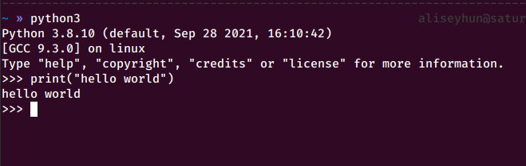
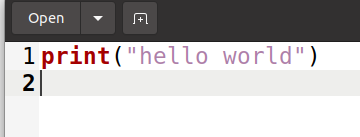
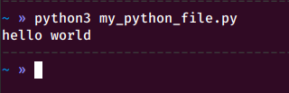
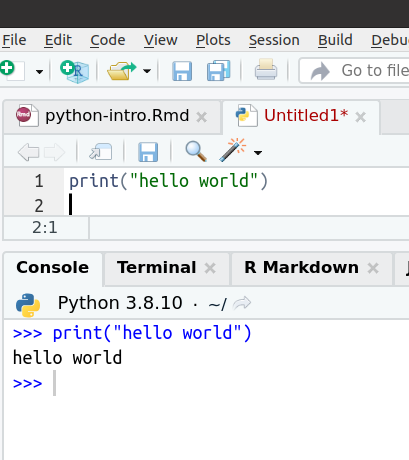
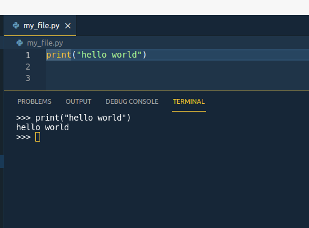
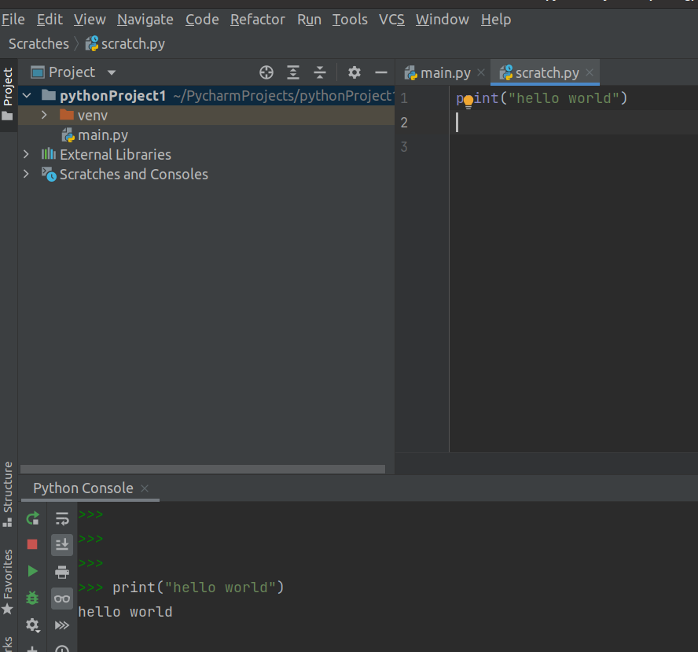

```{css, echo=FALSE}
.remark-code, .remark-inline-code {
	font-family: 'Source Code Pro', 'Lucida Console', Monaco, monospace;
  color: blue;
	background-color: rgba(222,222,222,0.3);
}
.titletext {
	font-size: 400%;
  margin-top: 350px;
  font-weight: bold;
  display:inline-block; 
}
```


```{r setup, include=FALSE}
knitr::opts_chunk$set(echo = TRUE)
```
# What is Python?

```{r, echo=FALSE, out.width='25%', fig.align='center'}
knitr::include_graphics('images/pythonlogo.svg')
```
* `Python` is the one of the most popular general-purpose programming languages

--

* Applications include -but not limited to- web development, software development, data analysis, automated tasks...

--

* We will use `Python` as a **backend** in our `oTree` journey.  

--

* We will learn the fundementals, enought to kickstart `oTree`.  

---

# Hello World!

* To print things in the console, one should use `print()` function. 

--

* Let's go ahead and print `Hello World`:
```{python}
print("Hello World!")

```

---

# How to interact with Python
* Python is essentially a **command-line software**.
--


1- Python Interpreter:

```{r, echo=FALSE, out.width='75%', fig.align='center'}

```

---
# How to interact with Python
2- Running a Python script from command-line:

* Python scripts have the extension `.py`.


.pull-left[
```{r, echo=FALSE, out.width='100%', fig.align='center', fig.cap="my_python_file.py"}

```
]

--

.pull-right[
```{r, echo=FALSE, out.width='100%', fig.align='center'}

```
]

---
# How to interact with Python
3- Using a development environment

* Some of them are `PyCharm`, `VSCode`, `RStudio` and so on.
### RStudio
.
.pull-left[
```{r, echo=FALSE, out.width='80%', fig.align='center', fig.cap="Writing Python code in RStudio"}

```
]
.pull-right[
* Use `Shift + Enter` to send the command to shell
]
---

# How to interact with Python
3- Using a development environment

* Some of them are `PyCharm`, `VSCode`, `RStudio` and so on.
### VSCode
.
.pull-left[
```{r, echo=FALSE, out.width='100%', fig.align='center', fig.cap="Writing Python code in Visual Studio Code"}

```
]
.pull-right[
* Use `Shift + Enter` to send the command to shell
]
---

# How to interact with Python
3- Using a development environment

* Some of them are `PyCharm`, `VSCode`, `RStudio` and so on.
### PyCharm
.
.pull-left[
```{r, echo=FALSE, out.width='100%', fig.align='center', fig.cap="Writing Python code in PyCharm"}

```
]
.pull-right[
* Use `Alt + Shift + E` to send the command to shell
]
---
# How to interact with Python

* Using `python` as calculator:
--

```{python}
42 + 38
```
--

```{python}
36 * 5
```
---
class: inverse

.center[.titletext[Fundementals & Atomic Types]]
---
# Arithmethic Operators in Python

* `a + b` Addition

* `a - b` Subtraction

* `a * b` Mutiplication

* `a / b` Division

* `a ** b` Exponention (\\( a^b \\))

---
# Variables in Python
* Links a value to a name
* Case-sensitive
* Can contain any alphanumeric characters and underscores (A-z, 0-9, _)
* Cannot start with a number

--

```{python}
height = 297
width = 210

area_mm2 = height * width
print(area_mm2)
```

---

# Commenting in Python
If you have the character `#` on a line, python will not read the rest

--

```{python}
# Area of an A4 paper
height = 297 # in mm
width = 210  # in mm

area_mm2 = height * width  # in mm2
print(area_mm2)
```

---
# Types in Python
```{python}
# Area of an A4 paper
height = 297 # in mm
type(height)
```

--
```{python}
# Area of an A4 paper
height = 297.0 # in mm
type(height)
```
---
# Types in Python
We will deal with four main variable types:

* Integers (`int`): `1`, `2`, `-5` ,`2910`  

--

* Float (`float`): `1.0`, `2.5`, `-5.3` 
--
  ----> Decimal numbers

--

* String (`str`): `"hi"`, `'good morning!'`, `'Wow! 😲'` 
--
  ----> Text

--

* Boolean (`    bool`): `True`, `False`
--
  ----> Logical
  
---
# Types in Python
* Each type has its own set of rules

```{python, eval=FALSE}
3 + 5
```

--

```{python, echo=FALSE}
3 + 5
```

--

```{python, eval=FALSE}
'3' + '5'
```

--

```{python, echo=FALSE}
'3' + '5'
```

--

```{python}
"Hello" + " World!"

```
---
class: inverse

.center[.titletext[Lists]]

---
# Lists in Python
* Ordered collection of values

--

* They can contain different types

--

```{python}
a = [10,20,30]
b = ["ali", "bob", "chiara"]
c = ["ali", 2]
```

--

* Individual items can be accessed with an index

```{python}
a[0]
```

--

```{python}
b[1]
```
--
* **Important:** Indices in Python start from 0
---
# Lists in Python
* List are very flexible. They can also contain other lists.
```{python}
p1 = ["ali", 1987]
p2 = ["bob", 1953]

people = [p1,p2]
print(people)
```

--

```{python}
print(people[0])
```
--
```{python}
print(people[0][0])
```
---
# `list` type
* Like variables, list have their type `list` and they have their own operations.
```{python}
players1 = ["ali", "bob"]
type(players1)
```

--

```{python}
players1 = ["ali", "bob"]
players2 = ["chiara", "dana"]

print(players1 + players2)
```

---
# Subsetting lists
* Getting one item with index (Remember to start from `0`)
```{python}
players = ["ali","bob","chiara","dana"]
players[2]
```

--
* Start from the end (The last item is -1)
```{python}
players[-1]
```
--

* Slice it
```{python}
# list[start_index:stop_index(not included)]
# start: index 1(second item,included), stop: index 3(not included)
players[1:3]
```
--
---
# Subsetting lists
* Slice from the beginning and from the end
```{python}
players[:2]
players[2:]
```
---

# Be careful: Python variables are references
```{python}
my_list = ["ali", "bob", "chiara"]
another_list = my_list
```
--

```{python}
another_list[0] = "dana"
```
--

```{python}
print(my_list)
```

---
# Solution: Copy the list
```{python}
my_list = ["ali", "bob", "chiara"]
another_list = my_list.copy()
```
--

```{python}
another_list[0] = "dana"
```
--
```{python}
print(another_list)
print(my_list)
```
---
class: inverse

.center[.titletext[Dictionaries]]
---
# Dictionaries
* Also a collection of objects like `lists`

--

* Unlike lists, items have keys (in other words keywords)

--

* Can be created with:
  * `{key1: value1, key2: value2}`, or
  
  * `dict(key1=value1, key2=value2)`


```{python}
my_dictionary = {'ali': 1987, 'bob': 1953, 'chiara':1980}
```
--
```{python, echo=FALSE}
print(my_dictionary)
```

--

```{python}
my_dictionary2 = dict(ali=1987, bob=1953, chiara=1980)
```

--
```{python, echo=FALSE}
print(my_dictionary2)
```
---
# Get an item from dictionary
```{python}
birthyears = {"ali": 1987, "bob": 1953, "chiara":1980}
```
--

```{python}
birthyears["bob"]
```

---
# Adding item to dictionary
```{python}
birthyears = {"ali": 1987, "bob": 1953, "chiara":1980}
birthyears['dana'] = 1992
print(birthyears)
```

---
class: inverse

.center[.titletext[Conditional Statements]]
---
# Logical Operators
* We have two logical values: `True` and `False`

* `and` and `or` and `not` are the logical operators

* `and` means that both conditions must be true

* `or` means that at least one condition must be true

* `not` reverses the logical value

```{python}
a = 5
b = 10


print(a == 5 and b == 10)

print(a == 5 and b == 5)

print(a == 1 or b == 10)

print(not a == 1)

```

 Logical Operators
```{python}
a = 5
b = 10

print(a == 1 or b == 10)

print(not a == 1)

```


---
# `if` statement

```{python}
my_variable = 42
```
---
```{python}
my_variable = 42
if my_variable < 50:
    print("the variable is smaller than 50")

```

---
# Very important: Indentation
```{python}
my_variable = 42

if my_variable < 50:
    print("the variable is smaller than 50")

```

* Python doesn't have braces like `{ }` or `end` statements

--

* The hierarchy/ownership of the statements are determined by indents.

-- 

* `Four spaces` is the accepted convention but you can use `tab` or the another number of spaces as long as it is consistent.

--
* Graphical user interfaces does it mostly automatic.

---
# `else` statement

```{python}
my_variable = 42

if my_variable < 50:
    print("the variable is smaller than 50")
else:
    print("the variable is bigger than 50")

```

---

# `elif` statement

```{python}
my_variable = 42

if my_variable < 40:
    print("the variable is smaller than 40")
elif my_variable < 50:
    print("the variable is between 40 and 50")
else:
    print("the variable is bigger than 50")

```

---
class: inverse

.center[.titletext[Functions, Methods, Classes]]
---
# Functions in python
* Python has many built-in functions

```{python}
ages = [39,48,21,59]

max(ages)
```

```{python}
my_name = "ali"
len(my_name)

```
---
# We can build our own functions
* Functions are defined with `def` keyword.
```{python}
def min_max_difference(x):
    return(max(x) - min(x))
    # Beware of indentation


ages = [39,48,21,59]
min_max_difference(ages)

```
---

# Methods
* Some functions are associated to objects. They are called methods.
* The syntax for methods is `my_object.do_something()`

```{python}
ages = [39,48,21,59]

ages.index(21) # find the index of a given item

```
---
class: inverse

.center[.titletext[Week 2]]
---
# For loop over list items

* Lists are not just good for collecting items
* Also for looping over them

--

```{python}
my_list = [1,2,3,4]
```

```{python}
for x in my_list:
  print(x ** 2)
```

---

# Creating a new list using for loop

* We can generate an empty list and add items recursively.

--

* `list_name.append()` to add an item to a list


--


Example:

```{python}
my_list = [1,2,3,4]

squares = []

for x in my_list:
  squares.append(x ** 2)
  
```

--

```{python}
print(squares)
```

---

# List Comprehension
* List comprehension is a shorter syntax when you create a new list based on another list.
```{python}
my_list = [1,2,3,4]
```


```{python}

squares = []

for x in my_list:
  squares.append(x ** 2)
```


--

we can write instead:

```{python}
squares = [x ** 2 for x in my_list]
```


--
$$
S = \\{ x^2 | \text{ for all } x \in \text{my_list} \\}
$$

---
# List Comprehension

```{python}
my_list = [1,2,3,4]
squares = [x ** 2 for x in my_list]
print(squares)
```

--

* We can also add conditions

```{python}
my_list = [1,2,3,4]
squares = [x ** 2 for x in my_list if x > 2]
print(squares)
```

